# Dormant ReLU units — talk track

One claim per slide, one panel per slide. Every figure is written by
`trainRNNbrain/experiments_and_analysis/fig_slides.py`, which calls the manuscript's own panel
functions and loaders — if a number here disagrees with the paper, that is a bug, not a second
opinion.

`⚠` marks a slide whose figure does not exist yet.

Every figure is centred at one fixed width (760 px) so the deck reads at a constant scale — add new
ones as `

`, not as Markdown image syntax, which
cannot be centred.

---

## THE PROBLEM

### 1. Most units of a trained ReLU RNN never fire

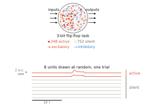

### 2. It is not a threshold artefact — the distribution is bimodal, on every task

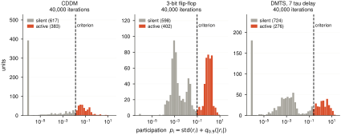

One network per task at N = 1000, all three read at the **same 40,000 iterations**. Active: 383,
269, 276 — the three tasks look alike at a matched budget.

### 2b. …and they diverge as training continues

The same three networks at the end of their own budgets. Active: 318, 269, 175. CDDM loses a further
65 units between 40k and 100k, DMTS a further 101 between 40k and 150k — the flip-flop panel is
unchanged because 40k is where it ends.

p_i = std(r_i) + q₀.₉(|r_i|). Active when p_i ≥ 0.05·q₀.₉₅(p) — relative to each network, which is
why the dashed line moves between panels. Shared x, separate count axes.

### 3. Units keep going silent long after the loss has stopped moving

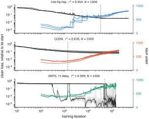

Three tasks, every seed. DMTS does not follow the other two — shown, not hidden.

Vanilla networks — no dropout, no penalty, no augmentation. Kept: every run whose training loss was
recorded; nothing else filtered, no seed averaged away, no unsolved seed removed. Grey is the raw
loss, black a running median over y[i−h … i+h], h = min(200, ⌊0.03·(i+1)⌋). The median removes 99.6%
of the step-to-step wiggle, which is why the raw is drawn under it. Loss normalised by its own first
value. The dashed rule is where the **raw** loss first comes within 7% of its final value.

The coloured silent-unit curve is **not smoothed at all** — it is the raw count, criterion from
slide 2, at every 100-iteration probe. It is simply that quiet: the median change between probes is
1–3 units. The occasional jumps of 200–300 are the relative criterion moving, not units switching
off together — when overall activity dips, 0.05·q₀.₉₅(p) falls with it and many units cross at once.

---

## WHY ITERATION COUNT IS THE WRONG CLOCK

### 4. The parameters never stop moving — all three tasks

‖W(t) − W(t−L)‖_F / ‖W(t)‖_F at L = 10,000, bias excluded, every seed. Still 10–100% of the weights'
own magnitude at 140,000 iterations.

### 5. A single iteration count cannot serve every condition

Iterations to reach 1.07× that run's **own** fitted floor, two tasks, every run drawn. Within a task
size barely moves it: the flip-flop goes 35k → 39k → 37k → 43k over an 8× range in N, CDDM 15k → 16k
→ 18k → 19k over a 10× range. Across tasks it does move: at N = 1000 CDDM reaches its floor at 16k
and the flip-flop at 39k, so the same rule lands at times differing by a factor of 2.4 on networks of
the same size. That is the argument for not fixing an iteration count.

CDDM is the cleaner of the two: its read-out rises monotonically with N, where the flip-flop's N=2000
sits below its N=1000 and the within-size scatter overlaps. The pooled fit over the whole unpenalised
flip-flop grid gives T ∝ N^0.143 [0.065, 0.244], which is 1.35× over an 8× size range.

Each panel prints its per-size budget because they are not equal, and each floor is fitted over its
own run's whole trace: a longer trace pins the floor down better and so crosses slightly later.

Six of the 96 unpenalised flip-flop runs never come within 7% of their own fitted floor and are
absent — at the looser 10% it was four. A run goes missing when its fitted floor sits a little below
what it actually reaches, so the threshold falls under its whole loss curve.

### 6. So: read every network where its own loss stops falling

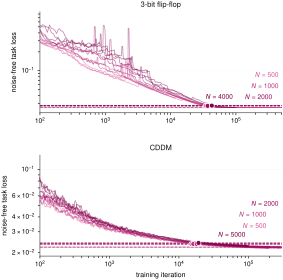

Four sizes per task, both tasks, every run drawn. Each size has its own fitted floor (dotted) and its
own crossing of 1.07× it (dashed, dot); the read-out iteration is in the legend. That iteration is
the read-out — not a number fixed in advance. Every count in this talk is taken there.

The four markers sit almost on top of each other because on both tasks the four sizes reach floors
within 2% of one another. The floors being that close is the point: what separates the networks is
when they get there, not where they stop. Drawn from iteration 100, since CDDM's loss is logged from
iteration 0 where an untrained network sits near 10³.

---

## THE SCALING

### 7. Active units grow as N^0.32–0.45 — so the fraction falls

Both silence criteria, both task families. Fitted exponents: 3-bit flip-flop 0.45, 6-bit flip-flop
0.32, CDDM 0.43, DMTS 0.37. Each network is read a matched number of iterations after it crossed its
task's convergence bar, not at a fixed iteration.

---

## WHAT DOES NOT WORK — one knob at a time

Throughout: R² is the **noise-free** score, re-simulated offline from each net's saved
parameters, never the folder-name score (one forward pass with the noise on). Active units
are the scale-free rule, p ≥ 0.05·q₉₅(p). N = 1000. Every seed drawn.

### 7b. The control is not one number — it depends when you look

The CDDM control's own active count against training: 411 at 30k, 272 at 200k. The sweeps below have
different budgets, so each panel is measured against the control at its own budget — the three
control numbers in this section are one network family read at three times, not three populations.

### 8. A different activation does not help

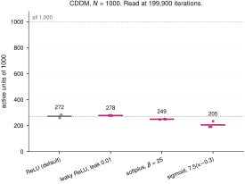

Of 1000 units: ReLU 272 active, leaky ReLU 278, softplus 249, sigmoid 205. None raises the count.

### 8b. And the units they shed were not doing anything

191–284 active units, all within 0.016 of R² = 0.950.

Noise-free matters here: the noise penalty is activation-dependent (+0.074 sigmoid against +0.062
softplus), so on the folder score sigmoid is the worst arm and noise-free it is level with the rest.

### 9. Nor on the other task

ReLU 263 of 1000 (282/261/247), sigmoid 240 — the seed ranges overlap. ⏳ Softplus and leaky ReLU
still training.

### 9b. Nor does it cost anything here

226–282 active units within 0.005 of R² = 0.967. Sigmoid holds 23 fewer units than ReLU and scores
higher.

### 10. Weight decay makes it monotonically worse

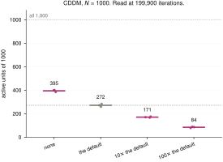

### 10b. …and the task does not notice the units it takes

Active units 395 → 272 → 171 → 84 across the ladder, a 4.7-fold drop; R² 0.950, 0.951, 0.953, 0.940.

Only the strongest rung costs anything: 10⁻⁴ is 0.011 below the default on a standard error of
0.004, the same sign in all three seeds.

### 11. A bigger input scale adds 40–75 units of 1000, and not monotonically

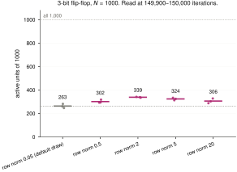

Rungs are the **absolute** L2 norm of each W_inp row at init. The default draw is 0.050, the bottom
of the ladder, so the rungs are 10×, 40×, 100× and 400× it — at true scale the curve is
single-peaked, 263 → 302 → 339 → 324 → 306. The N = 500 cells repeat the ordering: 191 → 219 → 237
→ 226 → 213.

It turns over because the knob is an initialisation, not a constraint: W_inp is trainable and every
arm up to row norm 5 ends at the same ‖W_inp‖_F ≈ 94 from starting totals of 1.7 to 158. All five
arms are still falling at the read-out.

For scale: training the reference past 150k with nothing changed takes it from 263 to 190. Every
input scale we tried buys less than the next 350,000 iterations take away.

### 11b. And the units it buys are free

247–342 active units, all within 0.002 of R² = 0.964.

### 12. The field-standard metabolic penalty moves nothing beyond seed scatter

### 12b. …and up to λ = 1 it is free

393–431 active units; λ ≤ 1 sits within 0.009 of R² = 0.97, λ = 10 pays 0.06.

**The ladder above is flat because the criterion moves with the penalty.** `mean(fr²)` shrinks the
rate scale 6× with no reversal (q₉₅ 0.33 → 0.33 → 0.23 → 0.14 → 0.05), and the bar at 0.05·q₉₅ falls
by the same 6×, dividing the effect out. On a fixed bar the same networks go 448 → 427 → 452 → 371 →
169. The units are turned down, not killed: at λ = 10, 568 still exceed 10⁻⁶ against 576.

### 13. Nor the equation form, nor a trainable bias

### 14. Removing recurrent noise is the largest effect — and it is negative

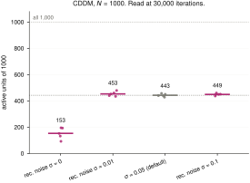

σ = 0 collapses to 153 active against 443 at the default and 449 at both other levels — a 2.9-fold
drop, and the only knob in this section that moves the count that far.

This sweep saved no participation traces, so it used to be scored on peak rate and read 524 at its
reference, out of step with the 414 next door. Its trained weights are on disk, so it is re-scored
from them onto the same rule as every other panel: the reference is 443, and the five seeds per
level are drawn rather than a summary interval.

### 15. Everything above, on one axis

Panel d. Each against its **own** matched reference. ⚠ wants its own export.

---

## WHAT DOES WORK

### 16. Five interventions, and where each one acts

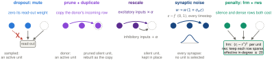

### 17. Active units

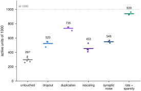

### 18. Performance, against the units it bought

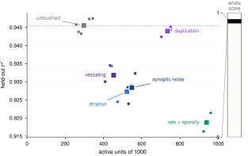

The same 22 networks as slide 17, now joined. The arms do not lie on one trade-off curve:
prune + duplicate recruits 474 units more than the control and lands on the control's own line
(−0.1%, its three seeds inside the control's seed range), while dropout, rescale and synaptic noise
each give up 1.3–1.9% for fewer units than that. The penalty pair buys the most units, 939 of 1000,
and pays the most, −2.7%.

### 19. Dimensionality

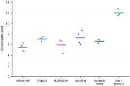

### 20. Weight distribution — lognormal, and which way it errs

### 21. Does it survive a change of size? — units

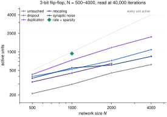

### 22. …and performance

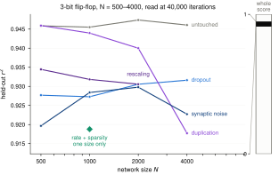

---

## PER-INTERVENTION DETAIL

### 23. Dropout, along training

### 24. Dropout is capped: the sampler cannot see firing

### 25. Prune-and-duplicate ⚠
Needs its own figure: recruitment against jitter, and the output unchanged at the moment of surgery.

### 26. Synaptic noise ⚠
Needs its own figure: the σ_w ladder, active units and clean r² against noise level.

### 27. The penalty pair ⚠
`fig_paper_F3.pdf` exists but will not render in Markdown — needs an SVG export.

---

## Open

- The four-measure comparison is one task. CDDM and DMTS size series are training.
- Three figures still to build (the last three slides) and one panel to export (slide 14).
