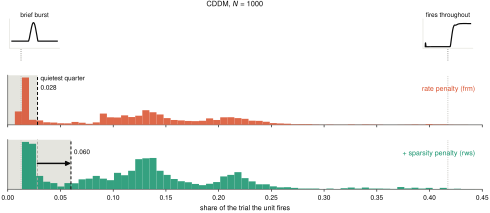
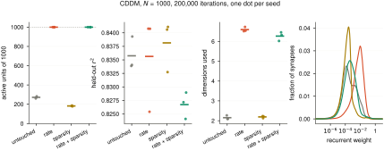

# Dormant ReLU units — talk track

One claim per slide, one panel per slide. Every figure is written by
`trainRNNbrain/experiments_and_analysis/fig_slides.py`, which calls the manuscript's own panel
functions and loaders — if a number here disagrees with the paper, that is a bug, not a second
opinion.

`⚠` marks a slide whose figure does not exist yet.

## The standard network

Every result in this deck is a ReLU RNN with **self-connections on, the bias fixed at 0, no Dale
constraint, no input/output positivity constraint, and no cubic term (γ = 0)**, trained for at least
50,000 iterations. Any panel whose networks depart from that says so under the figure, with the one
word that differs — nothing deviates silently.

Audited by `trainRNNbrain/experiments_and_analysis/standard_audit.py`, which reads each sweep's own
saved configs rather than trusting the launcher. `dale`, `io_nonnegativity` and `γ` conform
everywhere; the live deviations are a trainable bias on the older CDDM and flip-flop sweeps and
self-connections off on the recurrent-noise sweep. Those are being re-run.

Every figure is centred at one fixed width (760 px) so the deck reads at a constant scale — add new
ones as `<p align="center"></p>`, not as Markdown image syntax, which
cannot be centred.

---

## THE PROBLEM

### 1. Most units of a trained ReLU RNN never fire
<p align="center"></p>

### 2. It is not a threshold artefact — the distribution is bimodal, on every task
<p align="center"></p>
One network per task at N = 1000, all three read at the **same 40,000 iterations**. Active: 383,
269, 276 — the three tasks look alike at a matched budget.

### 2b. …and they diverge as training continues
<p align="center"></p>
The same three networks at the end of their own budgets. Active: 318, 269, 175. CDDM loses a further
65 units between 40k and 100k, DMTS a further 101 between 40k and 150k — the flip-flop panel is
unchanged because 40k is where it ends.

p_i = std(r_i) + q₀.₉(|r_i|). Active when p_i ≥ 0.05·q₀.₉₅(p) — relative to each network, which is
why the dashed line moves between panels. Shared x, separate count axes.

### 3. Units keep going silent long after the loss has stopped moving
<p align="center"></p>
Three tasks, every seed. DMTS does not follow the other two — shown, not hidden.

Vanilla networks — no dropout, no penalty, no augmentation. Kept: every run whose training loss was
recorded; nothing else filtered, no seed averaged away, no unsolved seed removed. Grey is the raw
loss, black a running median over y[i−h … i+h], h = min(200, ⌊0.03·(i+1)⌋). The median removes 99.6%
of the step-to-step wiggle, which is why the raw is drawn under it. Loss normalised by its own first
value. The dashed rule is where the **raw** loss first comes within 7% of its final value.

The coloured silent-unit curve is **not smoothed at all** — it is the raw count, criterion from
slide 2, at every 100-iteration probe. It is simply that quiet: the median change between probes is
1–3 units. The occasional jumps of 200–300 are the relative criterion moving, not units switching
off together — when overall activity dips, 0.05·q₀.₉₅(p) falls with it and many units cross at once.

---

## WHY ITERATION COUNT IS THE WRONG CLOCK

### 4. The parameters never stop moving — all three tasks
<p align="center"></p>
‖W(t) − W(t−L)‖_F / ‖W(t)‖_F at L = 10,000, bias excluded, every seed. Still 10–100% of the weights'
own magnitude at 140,000 iterations.

### 5. A single iteration count cannot serve every condition
<p align="center"></p>
Iterations to reach 1.07× that run's **own** fitted floor, two tasks, every run drawn. Within a task
size barely moves it: the flip-flop goes 35k → 39k → 37k → 43k over an 8× range in N, CDDM 15k → 16k
→ 18k → 19k over a 10× range. Across tasks it does move: at N = 1000 CDDM reaches its floor at 16k
and the flip-flop at 39k, so the same rule lands at times differing by a factor of 2.4 on networks of
the same size. That is the argument for not fixing an iteration count.

CDDM is the cleaner of the two: its read-out rises monotonically with N, where the flip-flop's N=2000
sits below its N=1000 and the within-size scatter overlaps. The pooled fit over the whole unpenalised
flip-flop grid gives T ∝ N^0.143 [0.065, 0.244], which is 1.35× over an 8× size range.

Each panel prints its per-size budget because they are not equal, and each floor is fitted over its
own run's whole trace: a longer trace pins the floor down better and so crosses slightly later.

Six of the 96 unpenalised flip-flop runs never come within 7% of their own fitted floor and are
absent — at the looser 10% it was four. A run goes missing when its fitted floor sits a little below
what it actually reaches, so the threshold falls under its whole loss curve.

### 6. So: read every network where its own loss stops falling
<p align="center"></p>
Four sizes per task, both tasks, every run drawn. Each size has its own fitted floor (dotted) and its
own crossing of 1.07× it (dashed, dot); the read-out iteration is in the legend. That iteration is
the read-out — not a number fixed in advance. Every count in this talk is taken there.

The four markers sit almost on top of each other because on both tasks the four sizes reach floors
within 2% of one another. The floors being that close is the point: what separates the networks is
when they get there, not where they stop. Drawn from iteration 100, since CDDM's loss is logged from
iteration 0 where an untrained network sits near 10³.

---

## THE SCALING

### 7. Active units grow as N^0.32–0.45 — so the fraction falls
<p align="center"></p>
Both silence criteria, both task families. Fitted exponents: 3-bit flip-flop 0.45, 6-bit flip-flop
0.32, CDDM 0.43, DMTS 0.37. Each network is read a matched number of iterations after it crossed its
task's convergence bar, not at a fixed iteration.

---

## WHAT DOES NOT WORK — one knob at a time

Throughout: R² is the **noise-free** score, re-simulated offline from each net's saved
parameters, never the folder-name score (one forward pass with the noise on). Active units
are the scale-free rule, p ≥ 0.05·q₉₅(p). N = 1000. Every seed drawn.

### 7b. The control is not one number — it depends when you look
<p align="center"></p>
⚠ **Deviates:** trainable bias (`bias_range [-1, 1]`). Re-run queued.
The CDDM control of slides 8, 10 and 11 against training: 411 at 30k, 272 at 200k. Slides 12 and 13
read a second sweep of the same architecture at 30k and get 414, which is this curve at that point.
So 272 and 414 are one population read at two times, not two populations. (Slide 14 is a third
architecture and sits apart — see there.)

### 8. A different activation does not help
<p align="center"></p>
⚠ **Deviates:** trainable bias, reference and arms alike. Re-run queued.
Of 1000 units: ReLU 272 active, leaky ReLU 278, softplus 249, sigmoid 205. None raises the count.

### 8b. And the units they shed were not doing anything
<p align="center"></p>
191–284 active units, all within 0.016 of R² = 0.950.

Noise-free matters here: the noise penalty is activation-dependent (+0.074 sigmoid against +0.062
softplus), so on the folder score sigmoid is the worst arm and noise-free it is level with the rest.

### 9. Nor on the other task
<p align="center"></p>
⚠ **Deviates:** trainable bias. Re-run queued.
ReLU 263 of 1000 (282/261/247), sigmoid 240 — the seed ranges overlap. ⏳ Softplus and leaky ReLU
still training.

### 9b. Nor does it cost anything here
<p align="center"></p>
226–282 active units within 0.005 of R² = 0.967. Sigmoid holds 23 fewer units than ReLU and scores
higher.

### 10. Weight decay makes it monotonically worse
<p align="center"></p>
⚠ **Deviates:** trainable bias, every rung. Re-run queued.

### 10b. …and the task does not notice the units it takes
<p align="center"></p>
Active units 395 → 272 → 171 → 84 across the ladder, a 4.7-fold drop; R² 0.950, 0.951, 0.953, 0.940.

Only the strongest rung costs anything: 10⁻⁴ is 0.011 below the default on a standard error of
0.004, the same sign in all three seeds.

### 11. A bigger input scale adds 40–75 units of 1000, and not monotonically
<p align="center"></p>
⚠ **Deviates:** trainable bias. Re-run queued.
Rungs are the **absolute** L2 norm of each W_inp row at init. The default draw is 0.050, the bottom
of the ladder, so the rungs are 10×, 40×, 100× and 400× it — at true scale the curve is
single-peaked, 263 → 302 → 339 → 324 → 306. The N = 500 cells repeat the ordering: 191 → 219 → 237
→ 226 → 213.

It turns over because the knob is an initialisation, not a constraint: W_inp is trainable and every
arm up to row norm 5 ends at the same ‖W_inp‖_F ≈ 94 from starting totals of 1.7 to 158. All five
arms are still falling at the read-out.

For scale: training the reference past 150k with nothing changed takes it from 263 to 190. Every
input scale we tried buys less than the next 350,000 iterations take away.

### 11b. And the units it buys are free
<p align="center"></p>
247–342 active units, all within 0.002 of R² = 0.964.

### 12. The field-standard metabolic penalty moves nothing beyond seed scatter
<p align="center"></p>
⚠ **Deviates:** trainable bias; 30,000 iterations, under the 50,000 floor. Re-run queued.

### 12b. …and up to λ = 1 it is free
<p align="center"></p>
393–431 active units; λ ≤ 1 sits within 0.009 of R² = 0.97, λ = 10 pays 0.06.

**The ladder above is flat because the criterion moves with the penalty.** `mean(fr²)` shrinks the
rate scale 6× with no reversal (q₉₅ 0.33 → 0.33 → 0.23 → 0.14 → 0.05), and the bar at 0.05·q₉₅ falls
by the same 6×, dividing the effect out. On a fixed bar the same networks go 448 → 427 → 452 → 371 →
169. The units are turned down, not killed: at λ = 10, 568 still exceed 10⁻⁶ against 576.

### 13. Nor the equation form, nor a trainable bias
<p align="center"></p>
⚠ **Deviates:** trainable bias; 30,000 iterations. (The trainable-bias arm deviates by construction — it is the knob.) Re-run queued.

### 14. Removing recurrent noise is the largest effect — and it is negative
<p align="center"></p>
⚠ **Deviates:** self-connections OFF, and 30,000 iterations. This is why its control reads 443 against slide 12's 414. Re-run queued.
σ = 0 collapses to 153 active against 443 at the default and 449 at both other levels — a 2.9-fold
drop, and the only knob in this section that moves the count that far.

This sweep saved no participation traces, so it used to be scored on peak rate and read 524 at its
reference. Its trained weights are on disk, so it is re-scored from them onto the same rule as every
other panel: the reference is 443, and the five seeds per level are drawn rather than a summary
interval.

443 is still 29 above slide 12's 414 at the same task, size and budget, and that is not scatter. It
is a different architecture: these networks have the bias fixed at 0 and every self-connection 0,
where every other CDDM sweep in this deck has a trained bias and nonzero self-connections. Compare
each knob with the control beside it, never across panels.

### 15. Everything above, on one axis
<p align="center"></p>
Panel d. Each against its **own** matched reference. ⚠ wants its own export.

---

## WHAT DOES WORK

These sweeps match the standard architecture on all five knobs. ⚠ **Deviates:** the
3-bit flip-flop grid trains 40,000 iterations, under the 50,000 floor — and its own
read-out (slide 5) lands at 35,000–43,000, so the budget ends where the measurement
begins. The CDDM (100k) and DMTS (150k) grids are clear of it.

### 16. Five interventions, and where each one acts
<p align="center"></p>

### 17. Active units
<p align="center"></p>

### 18. Performance, against the units it bought
<p align="center"></p>
The same 22 networks as slide 17, now joined. The arms do not lie on one trade-off curve:
prune + duplicate recruits 474 units more than the control and lands on the control's own line
(−0.1%, its three seeds inside the control's seed range), while dropout, rescale and synaptic noise
each give up 1.3–1.9% for fewer units than that. The penalty pair buys the most units, 939 of 1000,
and pays the most, −2.7%.

### 19. Dimensionality
<p align="center"></p>
**Participation ratio** of the active units' noise-free rates: covariance across units, eigenvalues
λ₁…λₙ (variance along each principal direction), then

&nbsp;&nbsp;&nbsp;&nbsp;**PR = (Σᵢ λᵢ)² ∕ Σᵢ λᵢ²**

A soft count of directions used — exactly n for n equally-loaded directions, → 1 when one dominates,
never an integer. Measured over active units only; a silent unit adds no variance.

### 19b. Two other counts, same answer
<p align="center"></p>
PCs for 99% of the variance (a hard count, feels the tail) against stable rank Σλᵢ∕λ₁ (the softest,
ignores the tail). The three measures weight the spectrum very differently and **agree anyway** —
pairwise r = +0.82 to +0.93 over 22 networks — so slide 19 is not an artefact of the participation
ratio. All three put the control lowest and frm + rws highest, and all three separate only those two:
of the six pairings among the middle four arms, one is significant on one measure and none on the
other two.

### 20. Weight distribution — lognormal, and which way it errs
<p align="center"></p>
<p align="center"></p>
**It errs toward too many very small weights — every arm, including the control.** The skew of ln|W|
is negative in all 22 networks, never positive: the departure is always a left tail of near-silent
synapses.

Width and shape fail independently, and only **rescale** commits both — 2.3× the control's width
*and* excess kurtosis 6.4 against 1.0. **frm + rws** is 2.0× wider but its shape is *nearer* an exact
lognormal than the control's (0.11 against 1.00). So wide is not bad in itself: the arm that works is
wide and keeps its shape. Dropout, duplication and synaptic noise do nothing here.

⚠️ **The reference is the control, not cortex.** The control's own KS distance to lognormal is 40× the
sampling scale, so no arm is lognormal in absolute terms. There is no published skewness of ln(EPSP)
to compare against, and paired recordings are detection-limited — blind to exactly the small-weight
excess these networks show.

### 21. Does it survive a change of size? — units, 3-bit flip-flop
<p align="center"></p>
Every arm beats the control at every size and none closes the gap to the diagonal: at N = 4000 the
control holds 596 of 4000, duplication 1764, dropout 1072. frm + rws is the lone diamond at N = 1000
(939 of 1000) — the one arm that nearly reaches the diagonal.

**Deviations.** Every arm here trains 40,000 iterations, so no point is read at a different
budget. frm + rws is **one size**: the 3-bit flip-flop has no frm + rws run at any N but 1000.
The other penalised flip-flop cells are k = 7 and k = 8, a different task, and the 400,000-
iteration penalty sweep is k = 1–8 at N = 1000, so neither extends this axis. rescale and
synnoise stop at N = 2000 in this build; their N = 4000 cells have since finished and join on
the next cache rebuild.

### 22. …and performance, same task
<p align="center"></p>
Held-out R² in the common test condition (σ_w = 0, shared recurrent and input noise, eight draws).
Read the axis before the shapes: it spans 0.03, so every arm at every size sits between 0.919 and
0.948. The control is flat at 0.946 across an 8× size range.

Duplication's drop at N = 4000 is the largest move on the panel and is worth 0.027 of R² (0.946 →
0.919). frm + rws sits at 0.919, level with synaptic noise at N = 500 — it buys 939 active units for
about 0.025 of R².

**Deviations.** Every arm here trains 40,000 iterations, so no point is read at a different
budget. frm + rws is **one size**: the 3-bit flip-flop has no frm + rws run at any N but 1000.
The other penalised flip-flop cells are k = 7 and k = 8, a different task, and the 400,000-
iteration penalty sweep is k = 1–8 at N = 1000, so neither extends this axis. rescale and
synnoise stop at N = 2000 in this build; their N = 4000 cells have since finished and join on
the next cache rebuild.

---

## PER-INTERVENTION DETAIL

### 23. A dropped unit can lose its output, or everything
<p align="center"></p>

A draw gives every unit two numbers: `c`, what it sends, and `s`, whether it runs.

```
    mute    dynamics untouched;      y = W_out (c * r)
    dead    dx_i/dt = -x_i + s_i [ (W_rec (c * r))_i + (W_inp u)_i + b_i + eta_i ]

    dropped   c_i = s_i = 0
    kept      s_i = 1,   c_i = 1 / (1 - p_i)   so the kept steps stand in for the dropped ones
```

`mute` can only pressure read-out redundancy. `dead` reaches the recurrent wiring as well.

### 23b. Beta decides how hard dropout aims at the busiest units
<p align="center"></p>

```
    v_i = std(r_i) + q_0.9(r_i)                a unit's firing rate, kept as a running average
    w_i = softmax( beta * rank_i / (M - 1) )   rank among the live units, 0 = quietest
```

Ranks, not raw scores: participation grows by more than tenfold over training, so on raw scores
beta = 4 ended up drawing the same unit every iteration. The code also implements `uniform`
(v = 1) and `output_weights` (v_i = sum_o |W_out[o,i]|); neither has been swept.

### 23c. The drop rate is a share of the units still alive
<p align="center"></p>

```
    pool    L = { i : v_i >= 0.05 * q_95(v) },   M = |L|
    p_i     = min( p_max, kappa * w_i ),  kappa set so that  sum over L of p_i = rho * M
    draw    d_i ~ Bernoulli(p_i), independently
```

Dropping an already-silent unit moves no other unit's state at all, so sampling over all N only
dilutes the dose. Independent draws are what make p_i the marginal drop probability, and that is
what makes the 1 / (1 - p_i) factor exact rather than a guess.

### 24. A higher rate, and a sharper aim, keep more units alive
<p align="center"></p>

Four rates by three exponents by two kinds, three seeds each. 3-bit flip-flop, N = 1000, no
penalty, 40,000 iterations, against the no-dropout cell of the same launcher.

Two settings are left out of the claim: `dead` at beta = 1 does not rise with the rate, and
`mute` at rho = 0.05 rises by 25 units inside a 59-unit seed spread.

An earlier version of this sweep found the rate irrelevant. That sampler scored |h|, which a
silent unit scores as highly as a busy one, so half of every dose landed where dropping does
nothing.

### 24b. mute recruits units for free; dead pays for them
<p align="center"></p>

The loss is the trainer's noise-free, dropout-off probe on a fresh batch, so every arm is scored on
the full network. Put the training noise back and the picture softens: `mute` then gives up two
points of R-squared, 0.945 to 0.922. `dead` is not in that cache, so its cost is quoted noise-free
only.

### 24c. Dropout slows the silencing; it does not stop it
<p align="center"></p>

At 150,000 iterations dropout holds 373 live units against 263, but is losing them faster, -216
against -161 per decade, so the gap is closing.

**Deviation.** These are the only dropout networks trained past 40,000 iterations and they predate
the sampler rewrite, so the corrected rule has never been asked this question.

### 25. Prune-and-duplicate ⚠
Needs its own figure: recruitment against jitter, and the output unchanged at the moment of surgery.

### 26. Synaptic noise ⚠
Needs its own figure: the σ_w ladder, active units and clean r² against noise level.

### 27. The penalty pair ⚠
`fig_paper_F3.pdf` exists but will not render in Markdown — needs an SVG export.

---

---

## THE PENALTY PAIR — what actually fixes it

### 28. CDDM: frm saturates the network, rws barely moves it
<p align="center"></p>
Control 201 → 272 → 311 → 629 across N = 500 → 5000. frm and frm + rws sit on the diagonal at every
size — 500, 1000, 2000, 4999 — and coincide, so only one line is visible. rws alone is **below** the
control at all four sizes: 142, 181, 279, 440.

Where a curve is on the diagonal the participation distribution is unimodal, so the count is a floor,
not a count. Budgets: control 200k/200k/300k/100k, penalties 200k/200k/150k/120k.

### 29. DMTS: the same, on the other task
<p align="center"></p>
Control 132 → 180 → 346 across N = 500 → 2000; frm 500, 996, 1952; frm + rws 500, 1000, 1844. rws
sits just above the control (161, 255, 406) rather than below it as on CDDM.

150,000 iterations throughout. 7τ delay — the 5τ re-runs supersede it.

### 30. rws does not change the typical unit — it rescues the worst ones
<p align="center"></p>
frm puts every unit over the silence bar, so the count saturates and cannot tell a unit that fires
throughout the trial from one that fires in a brief transient. tPR/n does — 1 for a constant rate,
near 0 for a burst.

Four rows, shared x. The effect is in the lower tail: the median barely moves (frm 0.123, frm + rws
0.125), but the lower quartile goes 0.028 → 0.060 and burst units (tPR/n < 0.05) fall from 28% to
24%. Every frm + rws seed is above every frm seed on both.

Right: the two extreme units of one frm network. The lowest (tPR/n = 0.013) fires one transient bump
and is silent the rest of the trial; the highest (0.417) steps up and holds.

### 31. frm against frm + rws, all four measures
<p align="center"></p>
CDDM, N = 1000, 3 seeds. Active units 272 → 1000 → 182 → 1000 (control, frm, rws, frm + rws);
R² 0.951 → 0.954 → 0.956 → 0.958; dimensionality 2.2 → 6.6 → 2.2 → 6.3. The weight distribution is
where the two penalised arms part: frm pushes the bulk to larger magnitudes, frm + rws less so.

So frm buys the units and the dimensions, rws buys neither — rws alone leaves both at control level —
and what rws contributes is the temporal quality of frm's units, not their number.

### 32. The selectivity configuration
<p align="center"></p>
Every active unit as a point in the top three principal components of its own response — the static
form of the selectivity movie. The control's 260 units collapse into a tight clump; frm's 1000 spread
along a curved one-dimensional arc; frm + rws fills a broader volume.

---

## Open

- The four-measure comparison is one task. CDDM and DMTS size series are training.
- Three figures still to build (the last three slides) and one panel to export (slide 14).
