# Dormant units in trained ReLU RNNs — talk track

One claim per slide, one picture per claim. The heading is the claim; the picture carries it. The
line under a figure names the task, the size and the budget when the figure does not, and nothing
else. Every caveat, every withdrawn claim and every cut panel is in the appendix at the end.

Rebuild every figure from the repository root:

```
python trainRNNbrain/experiments_and_analysis/fig_motivation.py        # the opening
python trainRNNbrain/experiments_and_analysis/fig_why_hard.py          # why it is hard
python trainRNNbrain/experiments_and_analysis/fig_mechanisms.py        # the five rule diagrams
python trainRNNbrain/experiments_and_analysis/fig_slides.py            # every data panel
python trainRNNbrain/experiments_and_analysis/fig_slide24_tradeoff.py  # the dropout grid
python trainRNNbrain/experiments_and_analysis/fig_supp_tasks.py       # the three tasks
```

Figures are centred at one width, so the deck reads at a constant scale — add new ones as
`<p align="center"></p>`, not as Markdown image syntax, which cannot be
centred. **The links are PNG, written by `deck_pngs.py` from each panel's PDF.** The PDFs and SVGs
are the talk's own assets and stay on disk; GitHub's blob view returns 503 on this file when its
images are 35 resolvable SVGs, and a PNG is a tenth the bytes for the dense loss-trace panels. `check_presentation.py` checks this file: every linked figure exists, no slide points at
another by number, no code identifier reaches the screen, no slide runs past 55 words, and every
figure on disk is either shown or accounted for below.

⚠️ **The deck does not yet rebuild from a clean checkout, and that is not new.** `fig_slides.py` at
HEAD imports `heldout_r2`, which has never been committed, so `import fig_slides` fails on a fresh
clone and no figure can be drawn. The same is true of `run_dims`, and of the five modules this
rewrite added (`fig_motivation`, `motivation_cache`, `fig_mechanisms`, `fig_why_hard`,
`why_hard_cache`). Every figure here was built from the working tree and every builder is on disk;
committing those files is what makes the claim "generated directly with code" true for anyone else.

---

# WHY

**Every trained network in this section ran its full budget** — 150,000 iterations on the 3-bit
flip-flop, 200,000 on CDDM. The results sections later read a different sweep at 40,000.

### A trained RNN is read the way a recorded population is read
<p align="center">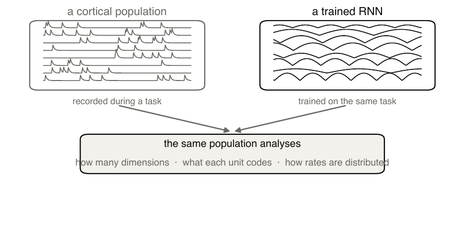</p>

### What the networks are asked to do
<p align="center">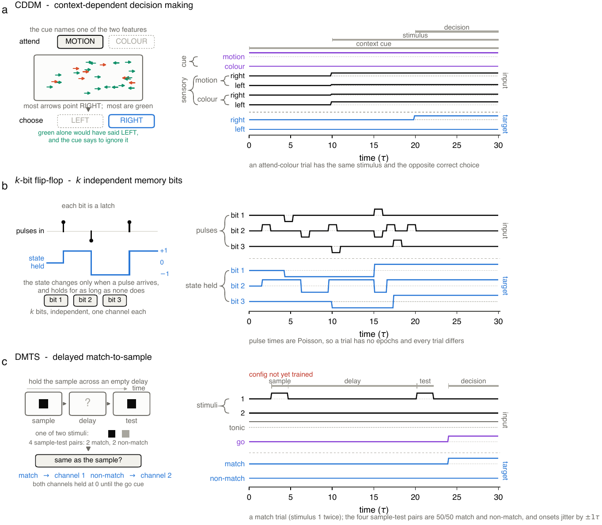</p>
Left, what the network is asked to do; right, the real input and target channels. τ is a unit's own
time constant and a trial is 30 of them. The match-to-sample row draws a redesign still in training;
its results later come from an earlier, longer-delay version, the least reliable of the three tasks.

### Train one, and three of four units never fire
<p align="center">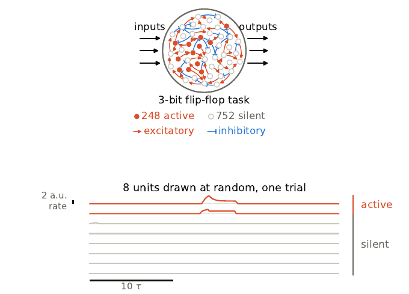</p>

### Training empties the network: 539 of 1000 fire untrained, 262 after 150,000 iterations
<p align="center">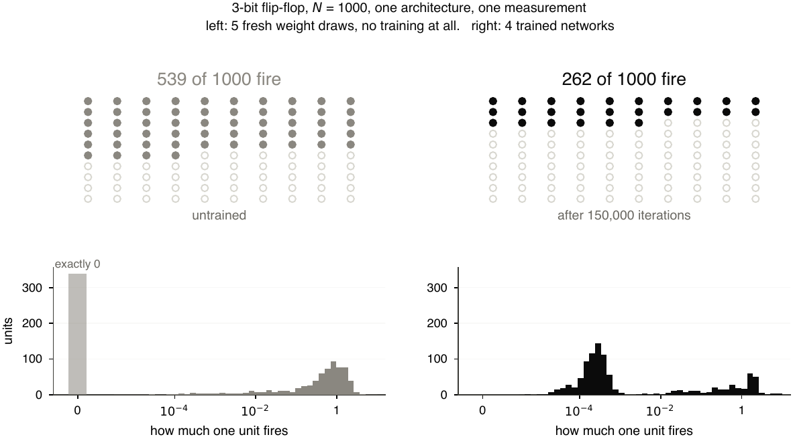</p>
**Untrained means zero gradient steps**, not an early checkpoint: five fresh draws of the same
architecture, 339 of whose units sit at exactly zero. The units training takes are not switched off
— they fire thousands of times less than a working one. No weight draw produces that middle group.

### Deep learning's own dormancy test counts the same units
<p align="center">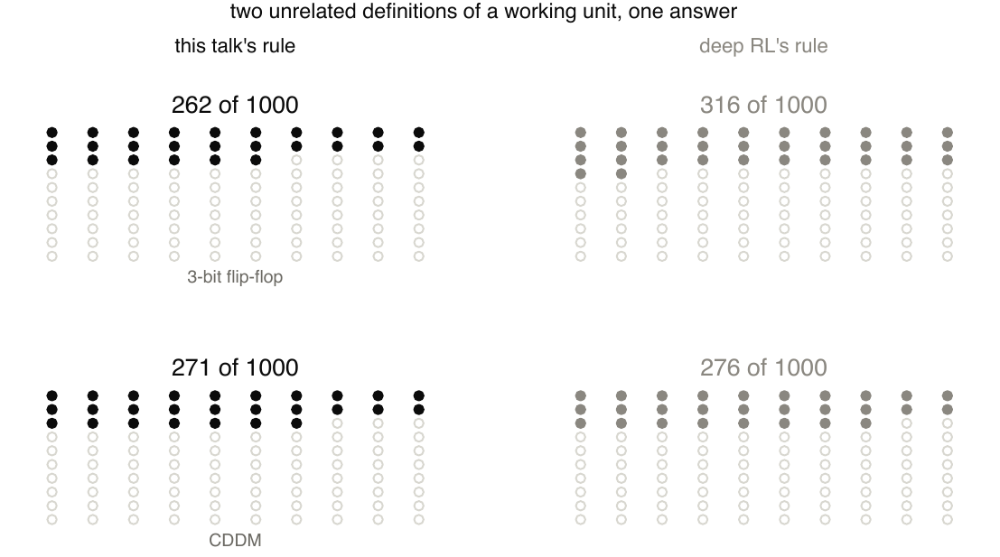</p>
Sokar et al.'s rule and this project's share no term and land within 60 units of 1000 of each other.
Machine learning calls the phenomenon loss of plasticity: Dohare et al. (Nature 2024) report Adam
leaving about 60% of units dead across a task sequence, and Adam is the optimiser here.

### Can a network reach the same score with every unit working?
<p align="center">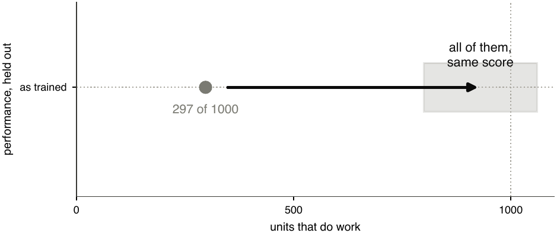</p>
The control here is the one every later result is measured against: the 3-bit flip-flop at
N = 1000, read at 40,000 iterations. That is why it holds 297 units and not the 262 two slides back.

---

# THE PROBLEM IS REAL

**Counts are comparable within a panel, not across panels.** Each sweep is read where its own loss
settles, so the same task at the same size reads a different control number on different slides.
Every panel carries its own control; read the gap, not the absolute number.

### Every task splits its units in two: a working few and a quiet crowd
<p align="center">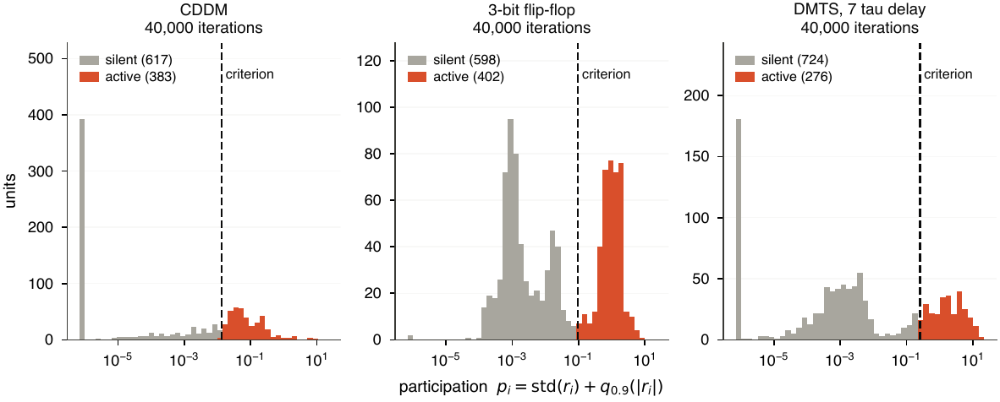</p>
**One unit, one number: how much its rate moves over a trial plus how high it gets.** A unit works
when that number clears 5% of the network's own 95th percentile — a bar with no absolute scale, so a
count means the same at any size. Every count here uses it.

### Every activation we tried ends with 200 to 300 units of 1000 working
<p align="center">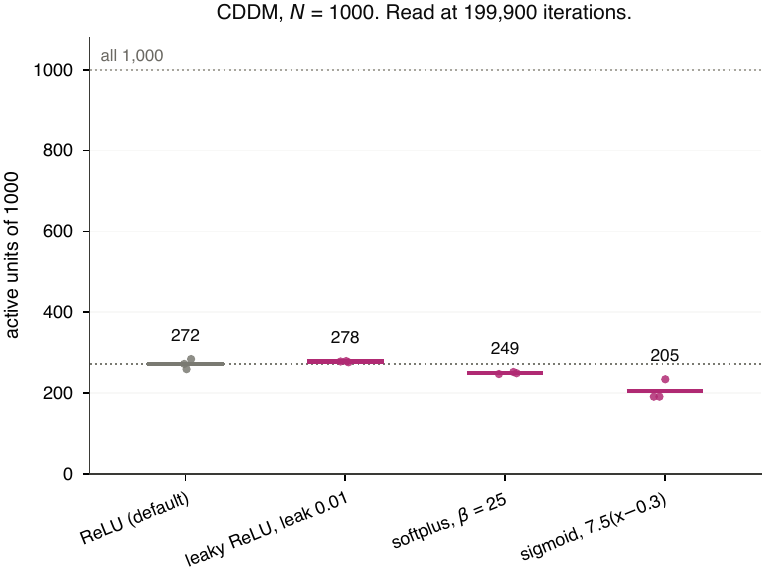</p>
Leaky ReLU and softplus keep a nonzero gradient everywhere and silence anyway. Bounded sigmoid parks
its quiet units at the lower asymptote rather than saturating them high, and leaves 67 fewer units
working than ReLU.

### Units keep going silent long after the loss has stopped moving
<p align="center">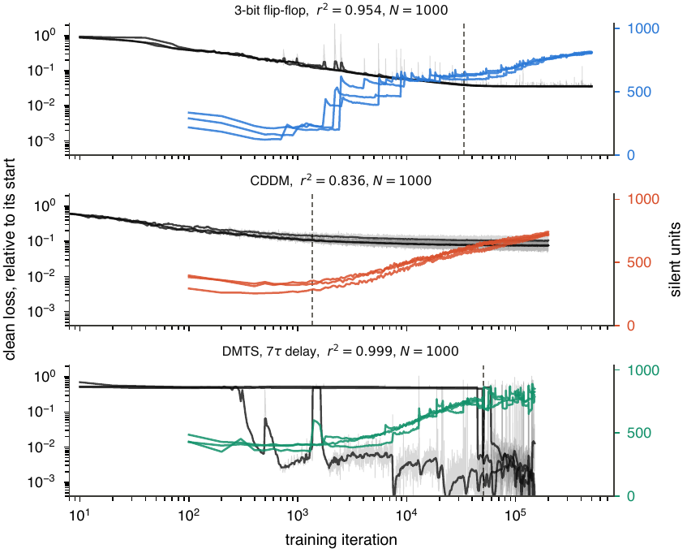</p>
Vanilla networks: no dropout, no penalty, no augmentation. Every seed whose loss was recorded is
kept. Dashed rule: where the loss first comes within 7% of its final value.

### All four sizes settle at the same loss and differ only in when they get there
<p align="center">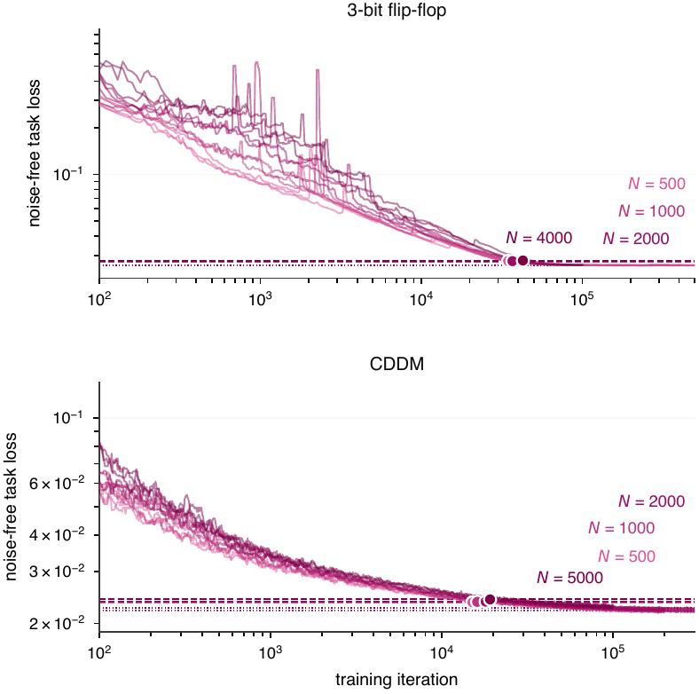</p>
The four sizes reach floors within 3% of one another, so what separates them is when they arrive
rather than where they stop.

### Bigger networks are emptier: every task falls from 52–65% of units working to 13–19%
<p align="center">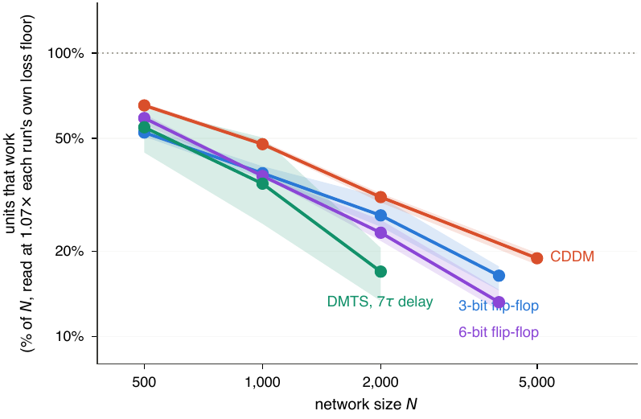</p>
The band is the seed range. The absolute counts still rise — CDDM goes from 327 to 945 units active
— which is why this panel plots the share and not the count.

---

# WHY IT IS HARD

### A silent ReLU unit has exactly zero gradient on every weight into it and out of it
<p align="center">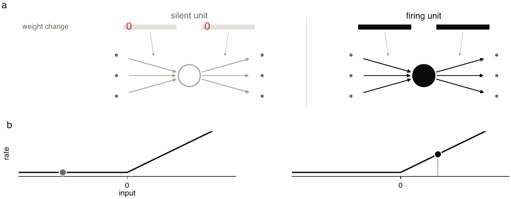</p>
So no term added to the loss can revive one. Every rule that works below acts on the weights
directly.

### Turn one back on and the network turns it off again
<p align="center">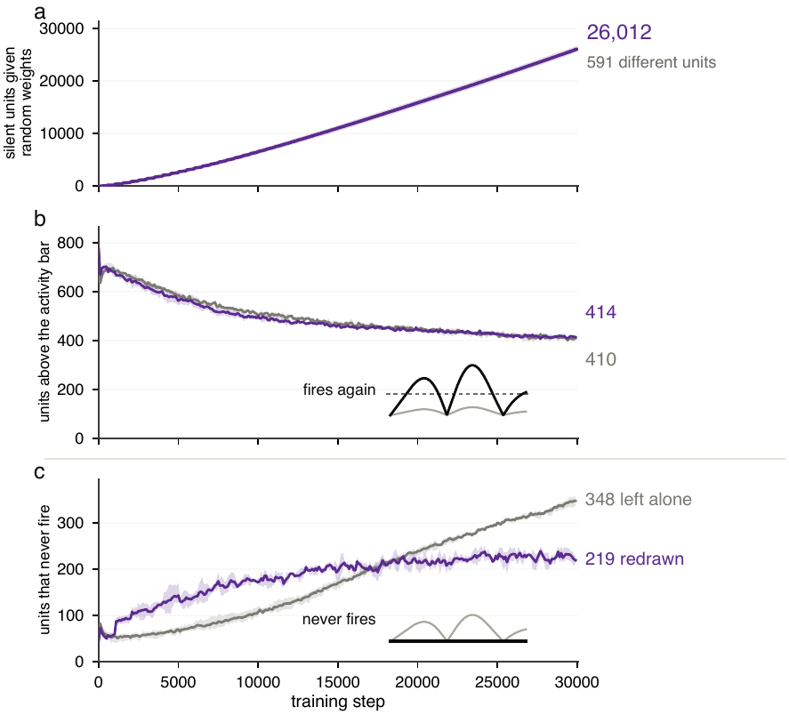</p>
A redraw gives a unit that has been silent too long a fresh set of random weights. It fires 26,000
times and buys four working units. Escaping the frozen state is not enough: a revived unit survives
only if the task finds a use for it.

---

# ONE KNOB AT A TIME

Settings a modeller already has. Two of them move the count a long way, and both point down.
Throughout: N = 1000, every seed drawn, each arm against the control beside it.

### Turn weight decay off and 395 units work; run it at a hundred times the default and 84 do
<p align="center">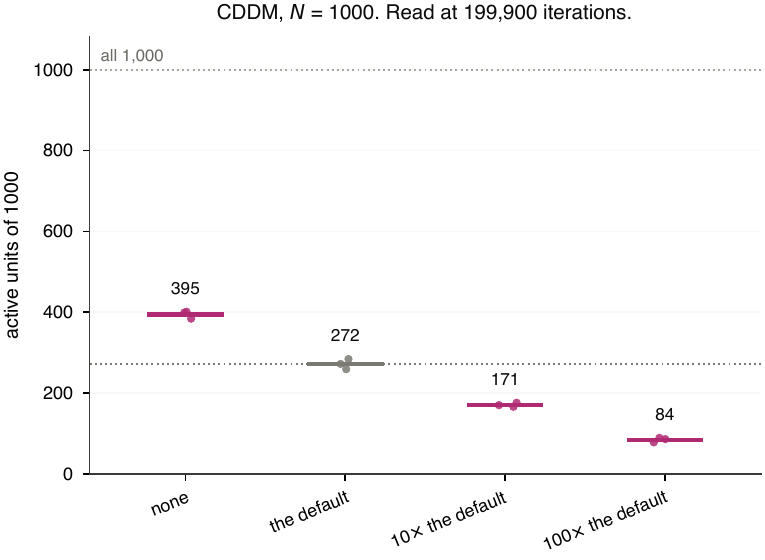</p>
The strongest single lever found here, and it is a hyperparameter usually set without thought.

### Removing recurrent noise costs almost three times the active count
<p align="center">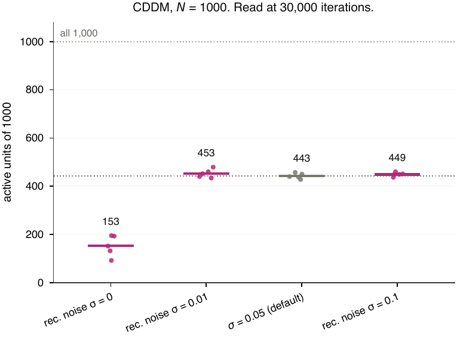</p>

### The metabolic penalty looks neutral because the bar shrinks with the rates it charges for
<p align="center">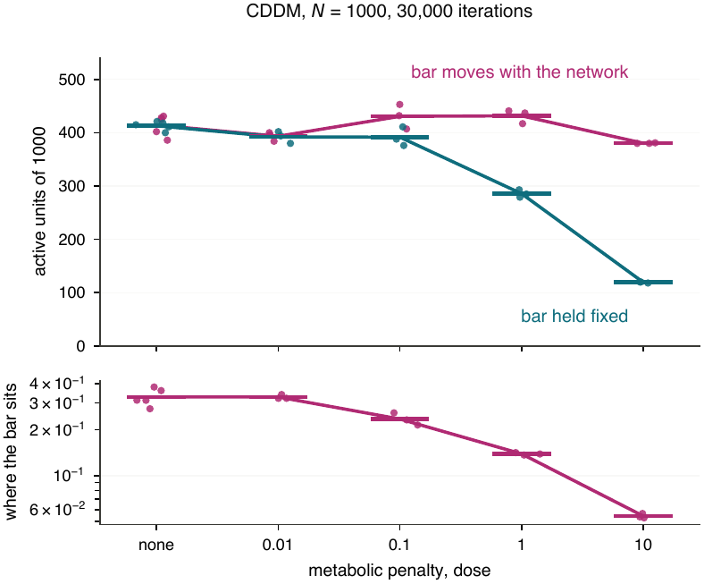</p>
The penalty shrinks the rate scale sixfold, and the bar, being a fraction of each network's own 95th
percentile, shrinks with it. Hold the bar at the control's value and the same networks fall from 413
to 119. The units are turned down, not killed.

---

# WHAT WORKS

**Every panel from here to the bottom line is the 3-bit flip-flop at N = 1000, read at 40,000
iterations,** unless its own title says otherwise. One dot is one network.

### Four rules change the weights by hand; the fifth changes the loss
<p align="center">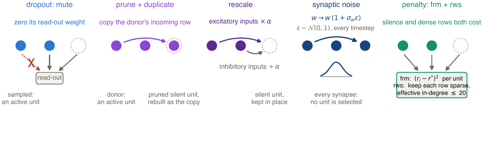</p>
The two penalty terms: `frm` charges a unit for missing a firing-rate target, `rws` for spreading
its input over too many partners. Every later slide calls them **rate** and **sparsity**, with the
code name in brackets where it appears at all.

### Every rule raises the count, from 297 of 1000 to between 453 and 939
<p align="center">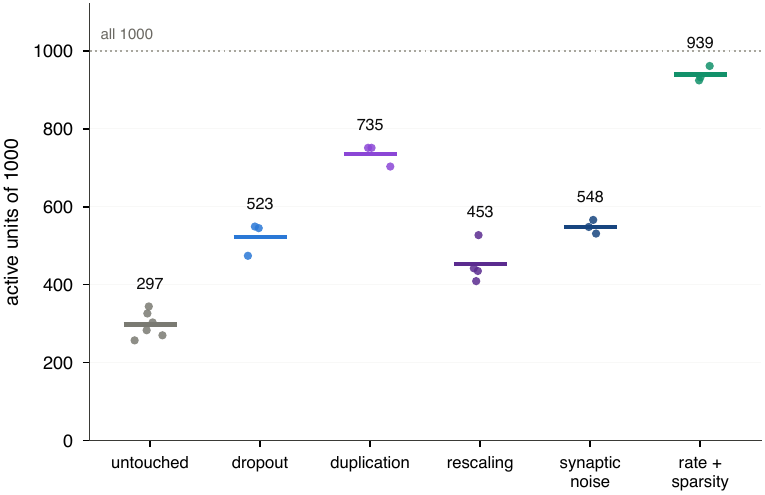</p>
3-bit flip-flop, N = 1000, 40,000 iterations, one dot per network.

### Duplication adds 438 units for a thousandth of the score; the others pay ten times more for fewer
<p align="center">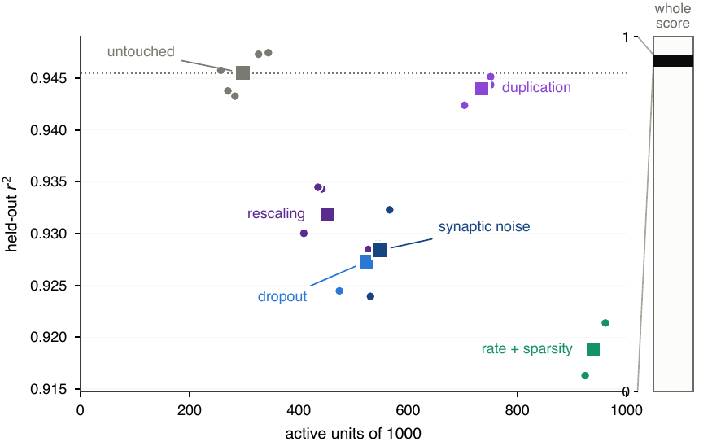</p>
The same networks, now joined. The arms do not lie on one trade-off curve: duplication recruits 438
units more than the control and pays a ninth to a twelfth of what dropout, rescaling and synaptic
noise each pay for fewer. Six control networks, three or four per arm.

### Only the penalty pair adds directions; the other four recruit copies
<p align="center">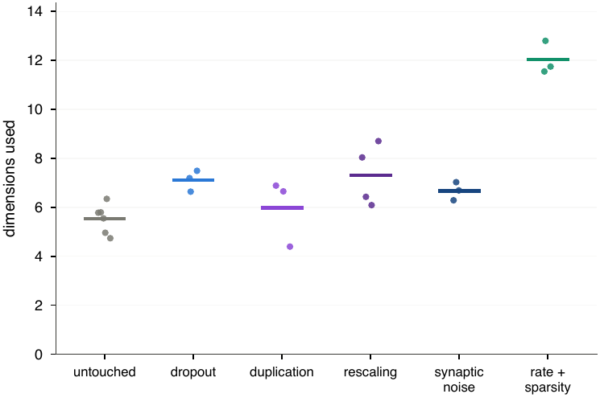</p>
A soft count of the directions the population's activity uses: exactly *n* for *n* equally loaded
directions, falling toward 1 when one dominates. Measured over active units, since a silent unit adds
no variance.

### Every rule beats the untouched network at all four sizes, and none reaches the diagonal
<p align="center">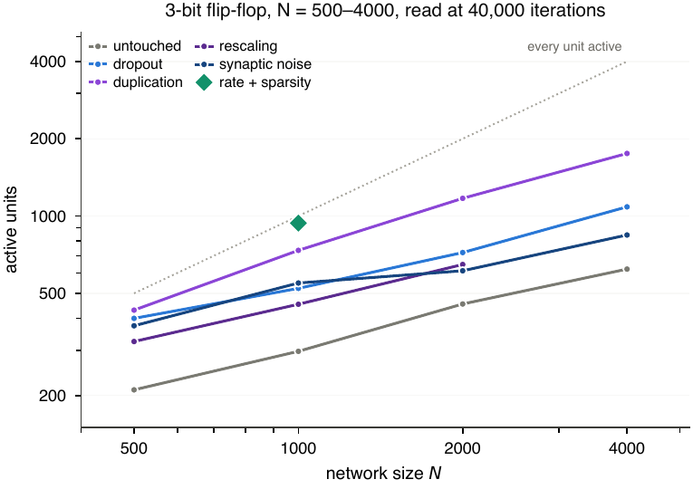</p>
Every arm beats the control at every size, and none closes the gap to the diagonal. The penalty pair
exists at one size only.

### Duplication is the cheapest rule at N = 1000 and the dearest at 4000
<p align="center">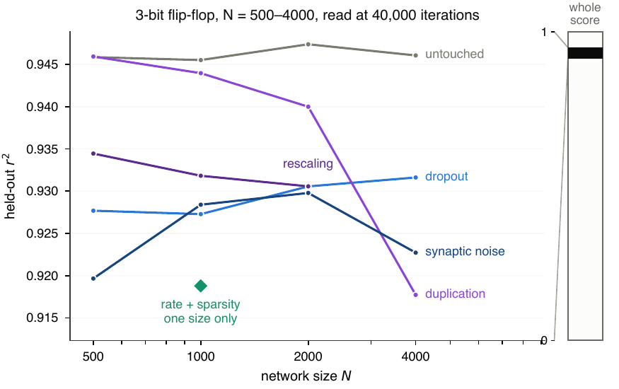</p>
The bar on the right is the whole score range, so the frame holds about three points of it.

---

# ONE RULE AT A TIME

In order of how many units each one recruits. The first is a setting; the five after it are
additions to training. **Still the 3-bit flip-flop at N = 1000, read at 40,000 iterations**, except
where a panel's own title says otherwise.

### A bigger input scale lifts 263 units to 339, at no measurable cost
<p align="center">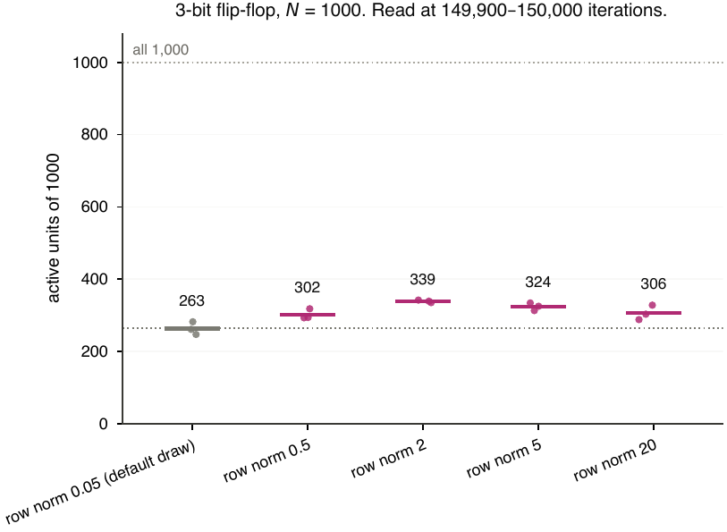</p>
The knob sets each input row's length at initialisation, over a 400-fold range, and nothing holds it
there afterwards. For scale: training the reference 350,000 iterations further loses 74 units, about
what the best rung buys.

### Rescaling revives a unit without adding one synapse: the row's total is held while its balance tilts
<p align="center">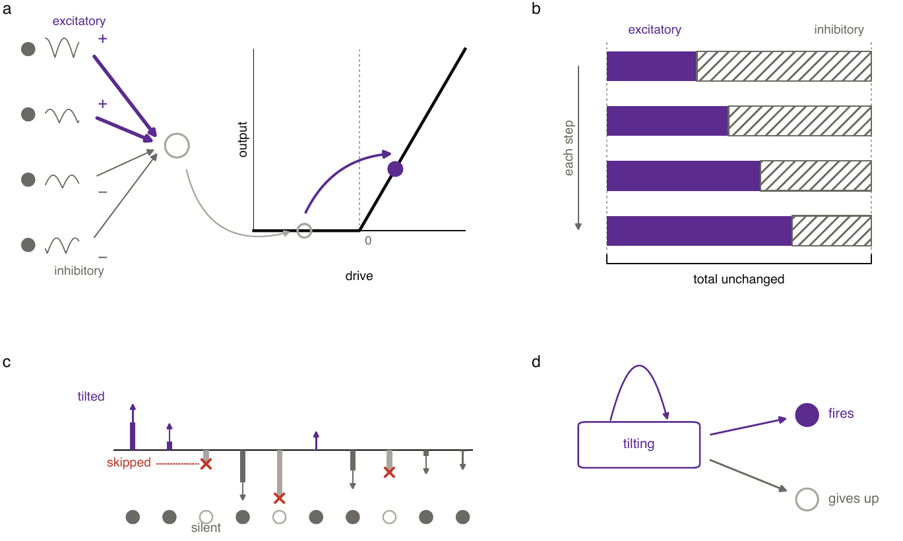</p>
The unit keeps every synapse it has, and nothing is added: the row's total length is held while its
balance tilts. Only synapses from units that are currently firing move — a synapse from a silent
source delivers nothing however large it is made.

### Any release target works: 384 to 450 units from 2.5 to 30, against 258 with none
<p align="center">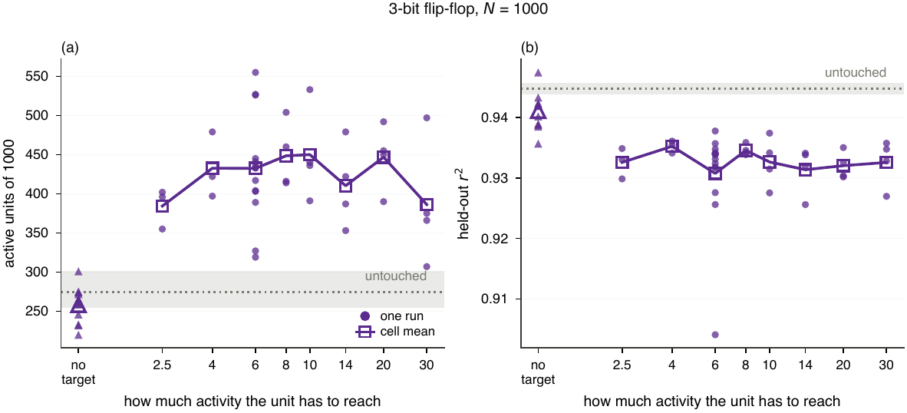</p>
Without a target the unit revives, the boost stops, and the gradient it now has puts it back. Every
rung costs the same 0.013 of the held-out score, so the price is for having a target at all, not for
setting it high.

### Dropout aims at the units that are working
<p align="center">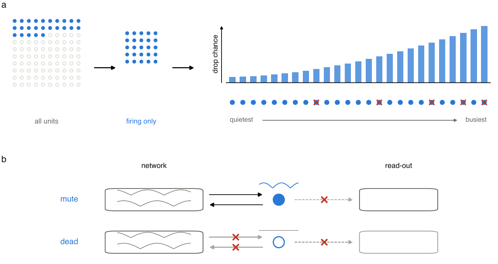</p>
A silent unit is never drawn: masking a unit that emits nothing moves no other unit's state at all.

### Hiding a unit from the read-out costs a third of what switching it off costs
<p align="center">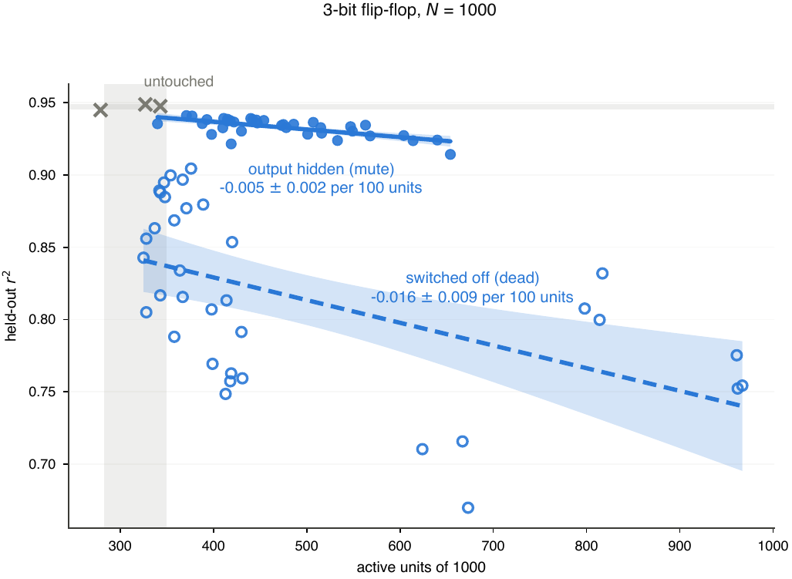</p>

### A second kind of noise: on every synapse, scaling with its weight, rather than at the cell body
<p align="center">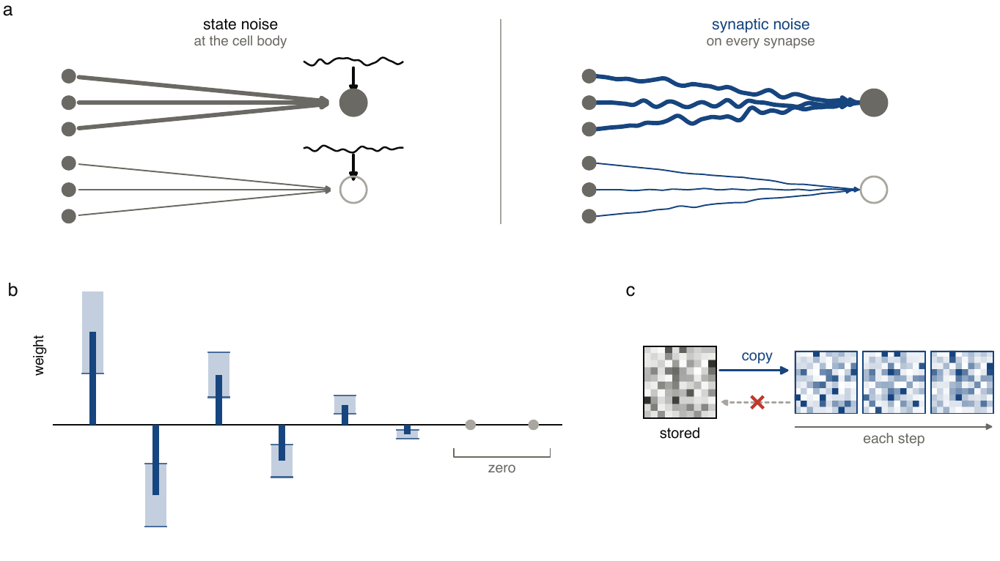</p>
Every network here already runs with noise injected at the cell body. Synaptic noise is a different
perturbation: it rides the weights the task is learning, so it reaches a unit through its wiring
rather than past it. The stored weights stay clean.

### Past a jitter of 1 the network needs the jitter to work
<p align="center">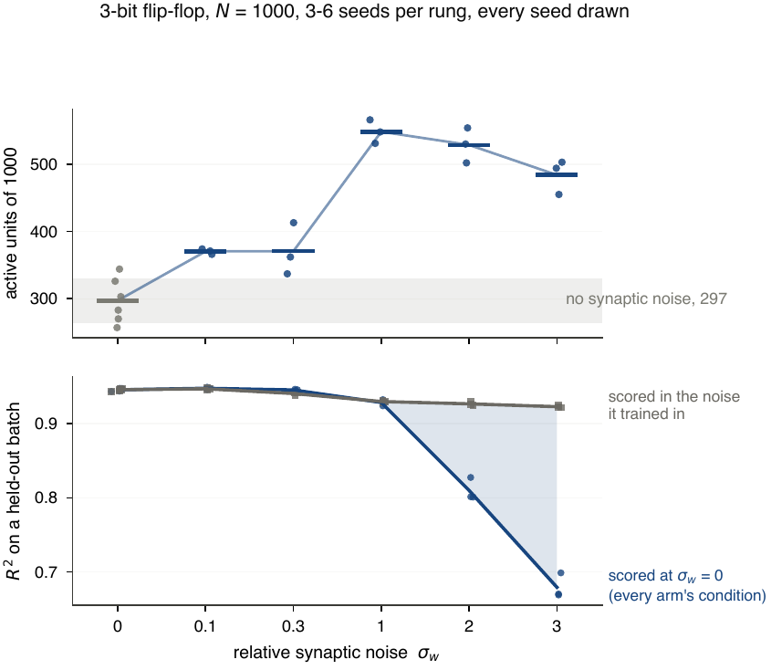</p>
The gap between the two scoring conditions is the dependence.

### Copy a working unit's inputs, split its output in two, and the network's behaviour is unchanged
<p align="center">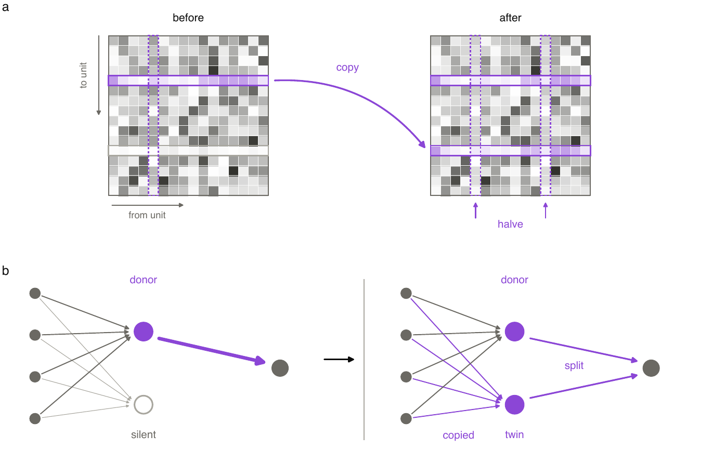</p>
The population never changes size: one row and one column of the same matrix are overwritten in
place. Splitting the donor's outgoing weight is what keeps the network's output the same at the
moment of the copy.

### The donor's output targets buy a third of the recruitment; the sizes of its inputs buy most of the rest
<p align="center">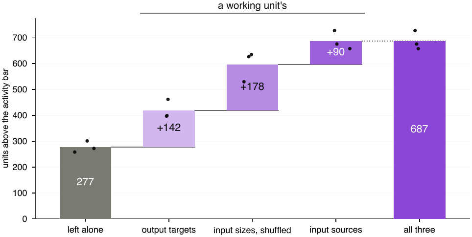</p>
Each step hands the dead unit one more thing the donor has: where it projects, then incoming weights
of the donor's magnitudes in scrambled positions, then those magnitudes on the donor's own sources.
All three together are the full copy.

### The rate term is a target, not a floor: it drags the loud units down as well as the quiet ones up
<p align="center">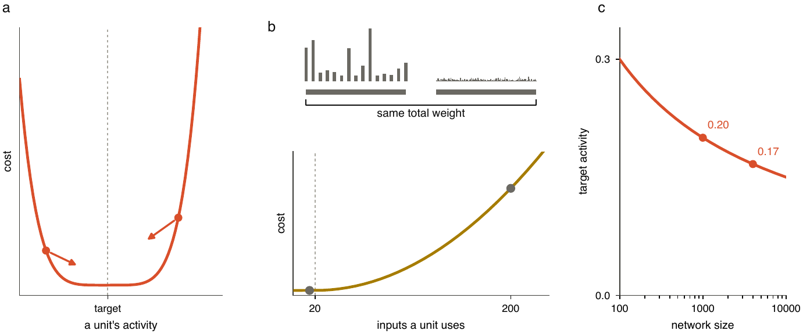</p>
The only arm that changes the loss rather than the network. The rate term is a target and not a
floor, so it drags the busy units down as well as the quiet ones up — which is how it flattens the
population.

### The rate term buys the units and the directions; the sparsity term costs 90 of them
<p align="center">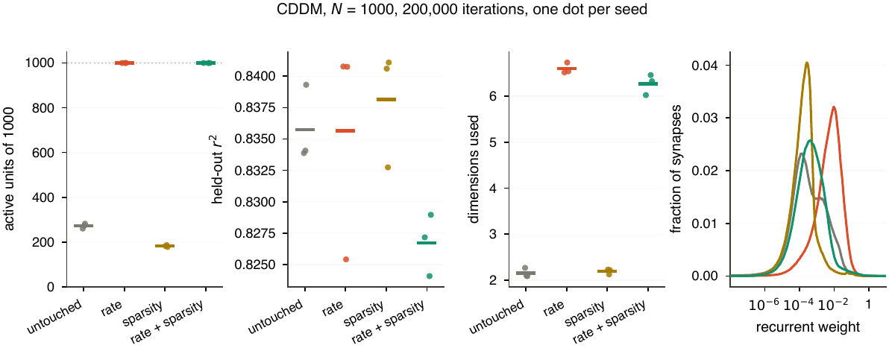</p>
The pair also scores worst of the four. What the second term buys is not on these axes.

### The sparsity term lifts the units that fire only in a brief transient
<p align="center">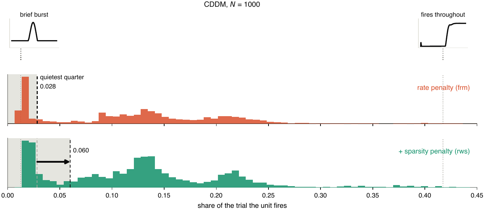</p>
CDDM at N = 1000 and 200,000 iterations — the penalty pair's own sweep, not the 40,000 grid above.
The effect is in the lower tail. The median barely moves; the quietest quarter goes from firing
through 2.8% of the trial to 6.0%, and every seed with both terms is above every seed with one.

---

# BOTTOM LINE

### What works, what does not
<p align="center">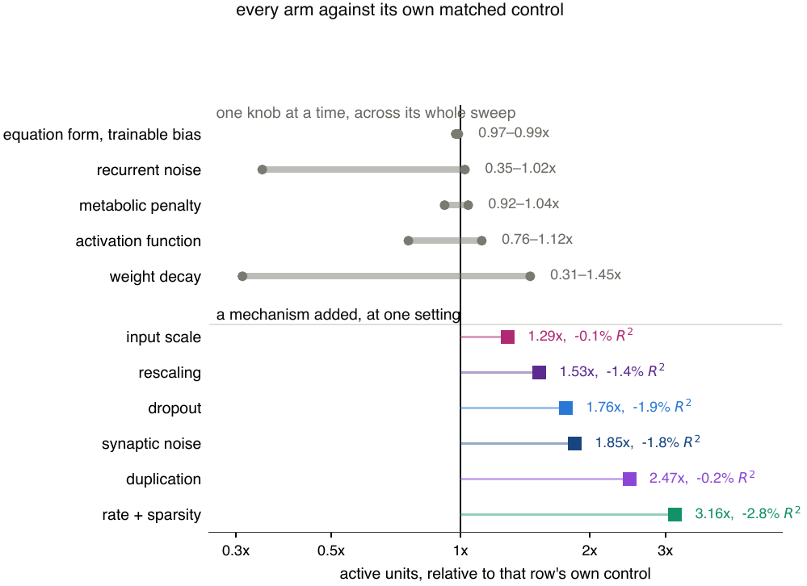</p>
---

# APPENDIX — shown only if asked

Nothing below is in the talk. It is here so that every number on a slide can be traced, and so the
panels that were cut are still one click away.

## The standard network

A ReLU RNN with self-connections on, the bias fixed at 0, no Dale constraint, no input/output
positivity constraint, no cubic term, trained for at least 75,000 iterations. Any panel whose
networks depart from that is listed under "deviations" below. The budget standard was measured, not
chosen: over the 493 runs on disk, 50,000 iterations reaches 1.07× a run's own fitted loss floor for
74% of them and 75,000 for 94%.

`standard_audit.py` reads each sweep's own saved configs rather than trusting the launcher. The Dale
constraint, the positivity constraint and the cubic term conform everywhere. The live deviations are
a trainable bias on the older CDDM and flip-flop sweeps, and self-connections off on the
recurrent-noise sweep.

## The two measurements every slide uses

**A unit is active** when p ≥ 0.05 · q₉₅(p), where p = std(r) + q₀.₉(|r|) over time and trials on a
noise-free pass. Relative to each network, so the bar moves between panels. Measured noise-free
because injected noise puts a floor under every unit's variance, and under that floor the rule
counts units the task never drives — which overcounted by 580% at N = 4000 before it was fixed.

**Performance is held-out r².** Inputs the network never saw, at the noise it trained with, σ_w = 0,
nine draws. The noise-free score is gone: it flatters networks that have come to use their own noise,
and the ranking of the interventions inverts between the two, so the choice of evaluation rather than
the remedy decided the result.

## Read-out rules, and why there are more than one

The deck's counts come from three rules and they are comparable within a rule, not across them.

| rule | where it is used | what it does |
|---|---|---|
| 1.07× each run's own fitted floor | the scaling slide, the read-out slide | stops each network where its own loss settles |
| an absolute per-task bar | figure 1(c) | 1.07× the worst final clean loss of that task's runs |
| a fixed iteration | the knob ladders | every rung of one ladder shares one budget |

## Panels cut from the talk

Each of these was in an earlier version. The reason for cutting is given, not implied.

| panel | why it is not in the talk |
|---|---|
| `slide_02_participation_by_task` | the same three networks at the end of their own budgets; the matched-iteration version makes the point without a budget caveat |
| `slide_04_drift_trajectories` | supports the read-out rule, which the read-out slide already states |
| `slide_05_readout_time`, `slide_05a_floor_fit`, `slide_07b_control_trajectory` | bookkeeping that reconciles control numbers across sweeps; the fix is "compare each arm with the control beside it" |
| `slide_x_activation_cddm_r2`, `slide_x_activation_ff_r2`, `slide_x_weightdecay_r2`, `slide_x_inputscale_r2`, `slide_x_metabolic_r2` | five companion scatters for one null result: the units cost nothing. That is the y axis of the payoff slide |
| `slide_x_activation_ff` | the same four-arm activation ladder on the flip-flop. One task makes the point, and the CDDM runs are the longer ones |
| `slide_x_metabolic` | the metabolic ladder on the moving bar alone. Replaced by `slide_x_metabolic_ruler`, which draws both bars and the ruler |
| `slide_02_participation` | one network's participation histogram; the three-task version replaces it |
| `slide_06_scaling` | the same data as the share panel, as absolute counts, with the fitted exponents. It is the manuscript's panel and it was in the talk until 2026-10-02, when it was misread the way its design invites: its red rule at 1,000 is an absolute milestone, every other panel in the deck draws a rule at 1,000 to mean the ceiling, and the CDDM series rises to meet it while falling to 19% of N |
| `slide_22b_penalty_by_task` | the two penalty-against-size panels on one figure, before they were split per task |
| `slide_24_dropout_rate_units`, `slide_24b_dropout_rate_cost` | the dropout grid split into two panels; `slide_24_dropout_tradeoff` carries both |
| `slide_f2_weights`, `slide_f2_weight_shape`, `slide_f2_weights_by_task` | the recurrent weight distributions per arm. Two arms widen it and fail differently, which is a paper result rather than a talk one |
| `slide_x_architecture` | equation form and trainable bias sit inside seed scatter |
| `slide_f2_r2` | a subset of the payoff scatter, which carries every r² value it does |
| `slide_f2_srank_vs_pc99` | three dimensionality measures agree, pairwise r = +0.82 to +0.93. A robustness check |
| `slide_20_rate_dist`, `slide_20b_rate_shape` | weight-magnitude lognormality, with no cortical number to compare against |
| `slide_23_dropout_selection`, `slide_23b_dropout_targeting`, `slide_23c_dropout_dose`, `slide_23d_dropout_kinds` | the sampler in full; the mechanism diagram carries what the talk needs |
| `slide_24c_dropout_along_training` | the only dropout networks trained past 40,000 iterations, and they predate the sampler fix, so they were aimed at the wrong units |
| `slide_25_prune_duplicate`, `slide_25b_prune_duplicate_3bitflipflop`, `slide_25b_prune_duplicate_cddm`, `slide_25b_prune_duplicate_all` | the jitter and size grids; the mechanism diagram and the decomposition carry the claim |
| `slide_25b_prune_duplicate_dmts` | 0 of 3 seeds solved at N = 1000 and 0 of 3 at N = 2000. Recruitment counted in networks that never learned |
| `slide_26b_synnoise_size`, `slide_26c_synnoise_scatter`, `slide_26d_synnoise_cddm`, `slide_26e_synnoise_along_training` | four more panels of the synaptic-noise arm after the ladder has made its point |
| `slide_26f_duplication_noise`, `slide_26g_duplication_ablation` | the duplication noise-dependence and ablation; their two caveats come from different networks and neither has been measured on the other's |
| `slide_27_rescale_rule`, `slide_27b_rescale_deficit`, `slide_27d_rescale_cost` | replaced by the mechanism diagram; the weight-deficit scatter is its inset |
| `slide_22b_penalty_cddm`, `slide_22b_penalty_dmts` | penalty against size. The DMTS version is the 7τ delay, where most seeds of most arms never solve |
| `slide_31b_penalty_rate_dist` | the rate distribution under each penalty |
| `slide_32_selectivity` | three 3-D scatters, each its own basis and its own viewing angle, at 30,000 iterations — a configuration that is gone by 200,000 |

## Two details the opening leaves out

- **Which units are dormant at initialisation is a property of the weight draw.** About 343 of 1000
  sit at exactly zero in an untrained network because their drive never goes positive for any input;
  a different seed picks a different 343. After training, dormancy is a property of the solution.
- **The agreement between the two dormancy rules holds across the whole threshold range Sokar et al.
  report,** not only at the value the figure draws. Over thresholds from 0.01 to 0.1 their count
  stays between 267 and 322 on the flip-flop and between 268 and 280 on CDDM, against this project's
  262 and 271. Their threshold of exactly zero is the one outlier, and on one task only: the
  flip-flop's quiet units sit near 10⁻³ rather than at 0, so "exactly zero" counts almost nobody
  there. That is the argument for a relative rule.

## What the overnight re-runs settled, and what they did not

Checked 2026-10-02, after the jobs that finished on 2026-10-01 were synced from both clusters.

- **The trainable-bias caveat is harmless on the activation ladder.** The four activations were
  re-run with the bias fixed at 0, which is the standard network. Active units go 266 / 276 / 250 /
  188 against the trainable-bias runs' 272 / 278 / 249 / 205 for ReLU, leaky ReLU, softplus and
  sigmoid — the same narrow band, the same ordering, and sigmoid still lowest. The deck still draws
  the trainable-bias runs, because the weight-decay, metabolic, input-scale and recurrent-noise
  re-runs have not finished and a half-converted section would put one ladder on the standard
  network and three beside it on something else. Switch all four together.
- **The penalty pair now exists at three sizes, not one.** 471 of 500, 937 of 1000 and 1841 of 2000
  units active — 92 to 94% at every size. The N = 4000 cell is still training.
- **Rescaling and synaptic noise reached N = 4000:** 1108 of 4000 and 846 of 4000, against the
  untouched control's 17% of 4000.
- **The DMTS delay change did not rescue the arms** — see the Open section.
- **Still training:** weight decay at bias 0 (1 to 2 seeds of 3 so far), the metabolic, input-scale
  and recurrent-noise bias-0 ladders, the penalty pair at N = 4000, and DMTS dropout at N = 2000.

## Known limitations of the figures themselves

- **Two conditions share one purple.** `paperstyle.COND_COL` maps both the `dead` dropout variant
  and prune-and-duplicate to the same hex, because the hue was freed when `dead` was dropped from
  the manuscript and then reused. The two never appear in one frame and both are labelled in place
  on every slide that shows them, so nothing in the deck is ambiguous as drawn — but a future panel
  that put them together would be.
- **Three details of the rules are not drawn.** The dropout diagram omits the rescaling of the
  surviving units (each is scaled by 1/(1−p) so the dropped pass matches the full network in
  expectation). The duplication diagram omits that donors are drawn in proportion to how active they
  are, and omits what happens to the donor's self-weight. The rescaling diagram shows four
  exaggerated steps where the real boost is 1.002 per step, and omits that the growing unit's
  incoming row is held out of the gradient while it grows.
- **The dropout diagram's panel (b) counts are drawn, not measured.** No number is printed on it, so
  it claims nothing false, but a viewer counting its dots is counting an illustration.

## Claims that were made and have since been withdrawn

Anyone who saw an earlier version of this talk heard some of these.

- **Penalties are free or better than free.** Retracted when the measure became held-out r². The old
  noise-free numbers read 0.951 → 0.954 → 0.956 → 0.958 across control, rate term, sparsity term and
  both, making the pair the best arm. Held out, the first three are level inside seed scatter and the
  pair is the worst of the four.
- **The metabolic penalty is free up to λ = 1.** Downgraded to "cheap". Held out, λ = 1 sits 0.014
  below λ = 0 against a seed scatter of 0.003 to 0.008.
- **Every rung of the synaptic-noise ladder buys units.** Retracted: the count was read under the
  very noise that lights the units up. Counted noise-free the ladder peaks at σ_w = 1 and falls back.
- **Scaling the input weights does not help.** Reversed. The rungs were labelled as multiples when
  the knob sets an absolute row norm, and the default draw is the bottom of the ladder.
- **Sharper dropout targeting is worse than useless.** Withdrawn: clipped probability mass was
  discarded rather than redistributed, so a nominal 50 drops became 7.9. That axis is unexplored.
- **The ReLU scale symmetry causes the silence.** Retracted after the sigmoid result. What stands is
  that the objective has no term keeping any particular unit active, and the walk to the floor
  happens under every activation tried.
- **Extra units are extra directions.** Wrong. Prune-and-duplicate adds the second-most units of any
  arm and the least dimensionality.
- **The donor's outgoing projection is the whole story for duplication.** It is a third of it.
- **Rescaling diverged at scale.** That note was itself wrong: both seeds recovered. A four-line
  window is not a trajectory.

## Open

- **Does recruiting the units restore plasticity?** The motivation section borrows the
  loss-of-plasticity framing from the continual-learning literature, and this project has not tested
  it. The test: train a control network and a recruited one on a task they have not seen, and compare
  how fast each learns. If the recruited network does not learn faster, the plasticity claim is
  motivation only and should be stated as such.
- **Do the interventions stack?** Nothing here combines them. Prune + duplicate, synaptic noise,
  dropout and a small penalty in one network: if the effects are additive the count should clear what
  any arm reaches alone, and if they are not, which pair cancels is itself the result.
- **Do the recruited units carry load?** Only duplication has been ablated, on one task at one size.
  Every arm needs it, because otherwise each remedy has been validated only on the measure it
  optimises.
- **Shortening the DMTS delay to 5τ fixes the control and not the arms.** The 5τ grid finished on
  2026-10-01 and is now on disk. Measured at the scale-free rule: the unpenalised control solves it
  3 of 3 at N = 500 and 1000 and 2 of 3 at N = 2000, against 2 of 3, 3 of 3 and 1 of 3 at 7τ — so
  the control is now reliable. Prune-and-duplicate solves 3 of 3 at N = 500, where it recruits 405
  units of 500 against the control's 137, and then fails outright: 0 of 3 at N = 1000 and 0 of 3 at
  N = 2000. Dropout fails 0 of 3 at every size, as it did at 7τ. So the column still cannot compare
  arms above N = 500, and the earlier note that the 5τ re-runs "replace the column" was optimistic.
  The N = 2000 dropout cell has not finished.
